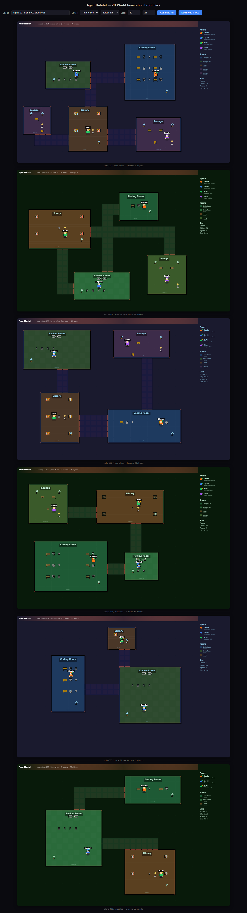
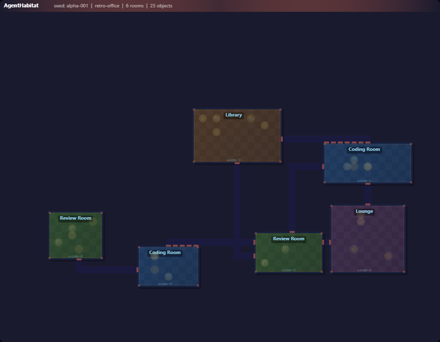
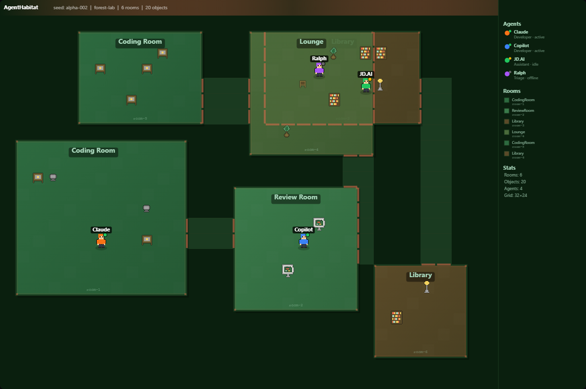
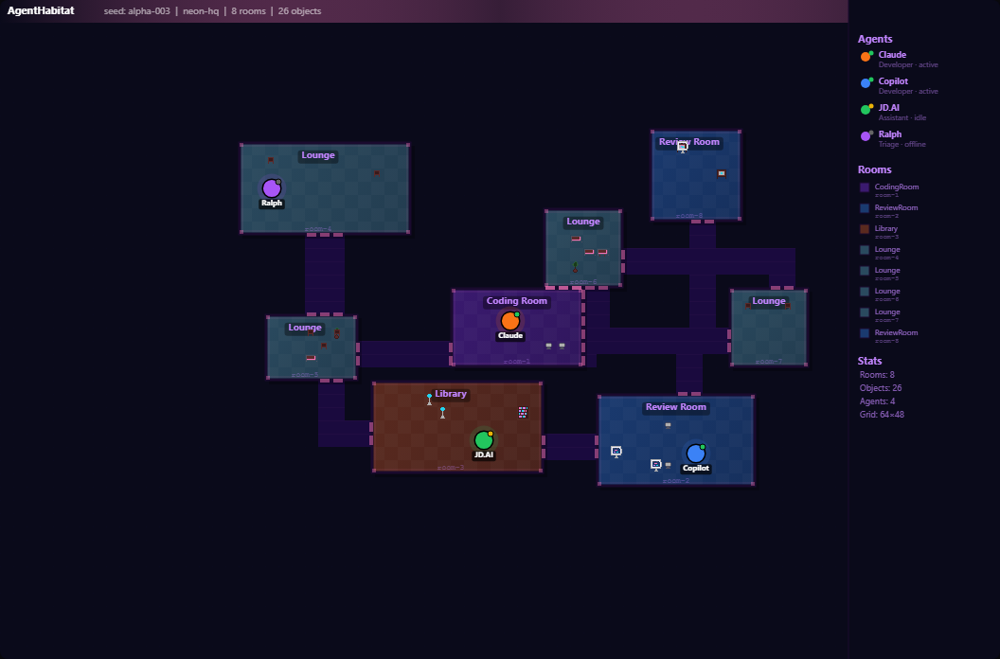

# AgentHabitat

[](https://github.com/JerrettDavis/AgentHabitat)
[](https://github.com/JerrettDavis/AgentHabitat/commits/main)
[](./package.json)
[](https://dotnet.microsoft.com/)

Deterministic 2D “agent habitat” world generation with production-style invariants, visual evidence artifacts, and a rapidly improving pixel renderer.

## Why this exists

AgentHabitat is focused on **reliable procedural world generation** for multi-agent environments:

- deterministic output for seeded runs
- hard spatial safety invariants (no overlap, reachable rooms, in-bounds placement)
- style-aware rendering evolution (retro / forest / neon)
- reproducible screenshot and evidence artifacts for QA and handoff

## Current status

- Core deterministic worldgen: ✅
- Invariant test suite: ✅ (`22/22` passing)
- Hero visual baseline locked and extended with fidelity rounds: ✅
- Public repo + remote parity: ✅

## Quickstart

### Prerequisites

- .NET SDK (net10.0 target)
- Node.js 22+
- npm

### Setup

```bash
# from repo root
npm install
dotnet restore AgentHabitat.sln
```

### Run tests

```bash
dotnet test AgentHabitat.sln -v minimal
```

### Generate world screenshots/evidence

```bash
node tools/capture-worldgen.mjs
```

Outputs are written to:

- `docs/poc/worldgen/*.png`
- `docs/poc/worldgen/evidence.json`

## Architecture at a glance

- **Core contracts**
  - `src/AgentHabitat.Core/WorldGen/Contracts/WorldGenerationContracts.cs`
- **Deterministic generator**
  - `src/AgentHabitat.Core/WorldGen/Implementation/DeterministicWorldGenerator.cs`
- **Validation / invariants**
  - `src/AgentHabitat.Core/WorldGen/Validation/WorldValidation.cs`
- **Test suite**
  - `tests/AgentHabitat.Core.Tests/WorldGenerationTests.cs`
- **Renderer + capture tooling**
  - `tools/worldgen-renderer.html`
  - `tools/capture-worldgen.mjs`

## Screenshot gallery

### Baseline / evidence views



### Style snapshots





### Artifact references

- Acceptance traceability: `docs/poc/acceptance-checklist-trace.md`
- Visual rubric: `docs/poc/worldgen-visual-rubric.md`
- Evidence matrix: `docs/poc/worldgen/evidence.json`
- Hash samples: `docs/poc/worldgen/hash-samples.json`
- Style hash matrix: `docs/poc/worldgen/style-hash-matrix.json`
- Screenshot manifest: `docs/poc/worldgen/screenshot-manifest.json`

## Roadmap

- [ ] PR1 docs track: comprehensive docs scaffold + navigation
- [ ] GitHub Pages docs site deployment
- [ ] CI workflows (build/test/artifact checks)
- [ ] Release workflow + semver + changelog
- [ ] Animation fidelity expansion (idle/walk polish)
- [ ] Further handcrafted sprite quality improvements

## Contributing

1. Create a branch from `main`.
2. Keep deterministic behavior stable for seeded runs.
3. Run `dotnet test AgentHabitat.sln -v minimal` before push.
4. Include evidence updates for visual/invariant-affecting changes.
5. Open a PR with:
   - summary
   - test results
   - before/after screenshots (when renderer changes)

## Notes

- This repo currently uses lightweight docs under `docs/poc` while full docs scaffolding is in progress.
- All visual quality iterations must preserve the invariant safety baseline.
